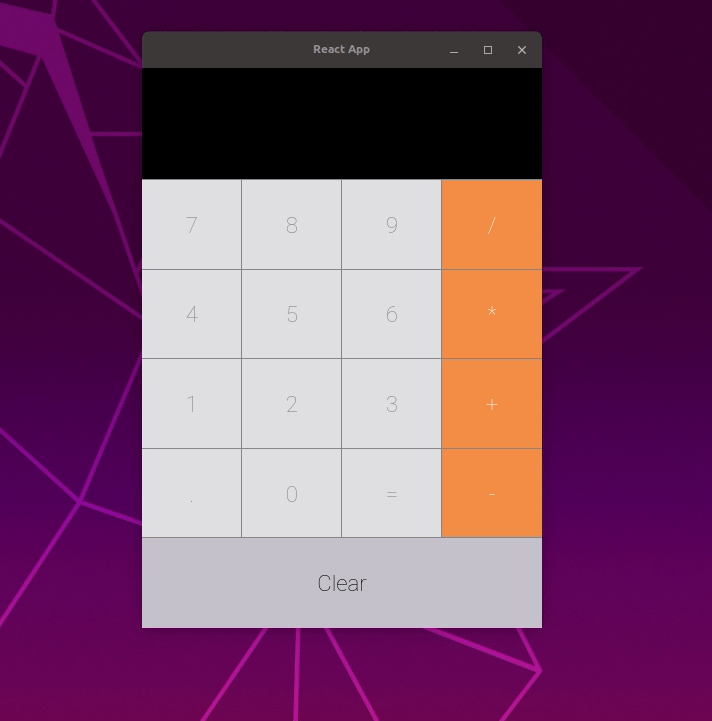

# React Calculator

## About

A simple OSX like calculator written in React typescript using only functional components.
Wrapped into a Electron Desktop App

Creds go to Brice Ayres ([his youtube channel](https://www.youtube.com/channel/UC9nBRXEi-gthsZf8BBhp_Jw)) 
who made a very nice video explaining how to build such a calculator in react
[@see](https://www.youtube.com/watch?v=KzYUuTiHdiY).

## Install

`cd ../react-calculator`

`npm install`

`npm start`

## Technologies Used
- Electron
- React
- Typescript
- Sass
